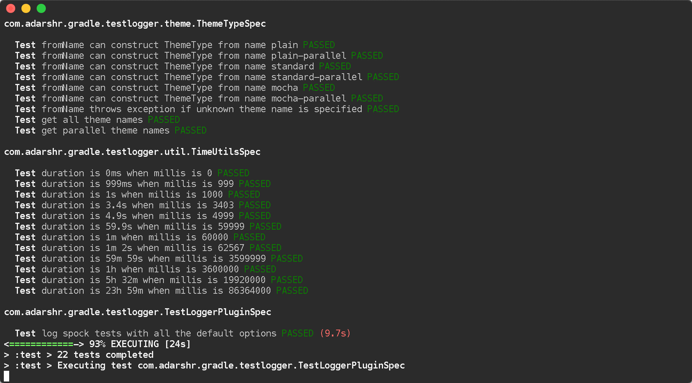
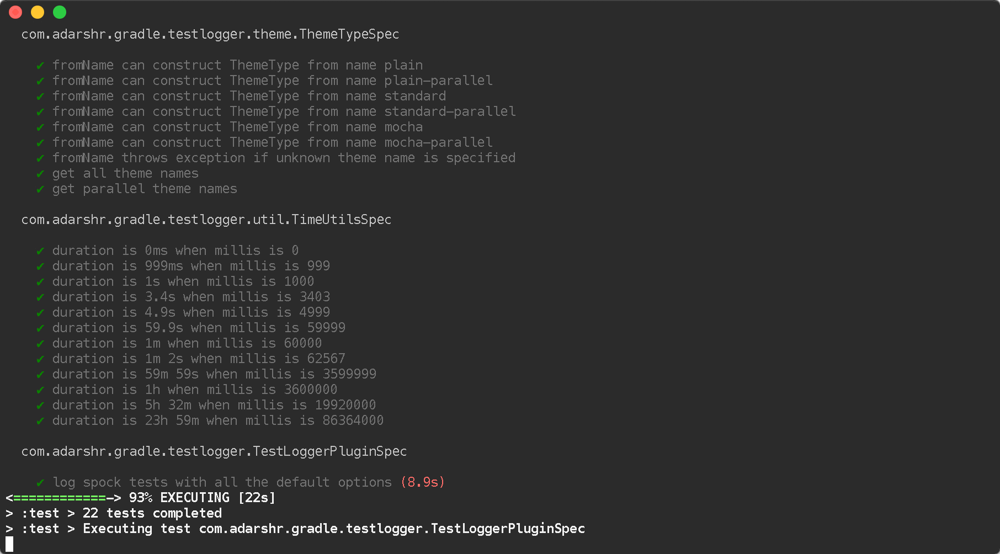

# Gradle Test Logger Plugin

[](https://plugins.gradle.org/plugin/com.adarshr.test-logger)
[](https://circleci.com/gh/radarsh/gradle-test-logger-plugin/tree/develop)
[](https://ci.appveyor.com/project/radarsh/gradle-test-logger-plugin/branch/develop)
[](https://coveralls.io/github/radarsh/gradle-test-logger-plugin?branch=develop)
[](https://github.com/radarsh/gradle-test-logger-plugin/blob/develop/LICENSE)
[](https://twitter.com/intent/follow?screen_name=radarsh)

A Gradle plugin for printing beautiful logs on the console while running tests.

## Screenshots

### Standard theme



### Mocha theme



Scroll down for more themes and customisation options or visit the [screenshots page](docs/SCREENSHOTS.md) for more demos.

## Usage

### Using the plugins DSL

```groovy
plugins {
    id 'com.adarshr.test-logger' version '3.2.0'
}
```

### Using legacy plugin application

```groovy
buildscript {
    repositories {
        maven {
            url 'https://plugins.gradle.org/m2/'
        }
    }
    dependencies {
        classpath 'com.adarshr:gradle-test-logger-plugin:3.2.0'
    }
}

apply plugin: 'com.adarshr.test-logger'
```

### Compatibility matrix

| Test logger version | Minimum Gradle version      |
|---------------------|-----------------------------|
| 1.x                 | 4.x                         |
| 2.x                 | 5.x                         |
| 3.x                 | 6.5                         |

## Configuration

The plugin registers an extension called `testlogger` (all lowercase and one word) at project level
as well as for each task of type [`Test`](https://docs.gradle.org/current/javadoc/org/gradle/api/tasks/testing/Test.html).

The following shows the complete default configuration applied when you configure nothing.

```groovy
testlogger {
    theme 'standard'
    showExceptions true
    showStackTraces true
    showFullStackTraces false
    showCauses true
    slowThreshold 2000
    showSummary true
    showSimpleNames false
    showPassed true
    showSkipped true
    showFailed true
    showOnlySlow false
    showStandardStreams false
    showPassedStandardStreams true
    showSkippedStandardStreams true
    showFailedStandardStreams true
    logLevel 'lifecycle'
}
```

### Project vs task level configuration

Settings configured at the project level can be overridden by redefining them at task level. Settings
not defined at task level will inherit project level values. Consider the below configuration.

```groovy
testlogger {
    theme 'mocha' // project level
    slowThreshold 5000
}

test {
    testlogger {
        theme 'standard-parallel' // task level
    }
}
```

In the above example, the effective theme will be `standard-parallel` and `slowThreshold` will be `5000` whereas rest of
the settings will retain their default values.

### Overriding settings at runtime

All the above settings can either be specified in `build.gradle` or be set at runtime using system properties or both.
For instance, we could have `theme` set to `mocha` in the build file but it can be overridden to be `standard` at runtime
by using `-Dtestlogger.theme=standard` on the command line. Since they are system properties we have a number of ways of
specifying them including `JAVA_OPTS` and `gradle.properties`.

- The convention used for determining the name of the system property is `testlogger.<configuration setting>`.
- System property overrides will be applied after combining task and project level settings.
- Specifying a system property override will apply the same setting for all tasks, regardless of any configuration
defined in the build file.

### Switch themes

```groovy
testlogger {
    theme 'mocha'
}
```

The following themes are currently supported:

1. `plain` - displays no colours or Unicode symbols
2. `standard` - displays colours but no Unicode symbols
3. `mocha` - similar to what [Mocha's](https://github.com/mochajs/mocha) [spec reporter](https://mochajs.org/#spec)
prints, with colours and Unicode symbols
4. `plain-parallel` - similar to the `plain` theme but supports parallel test execution
5. `standard-parallel` - similar to the `standard` theme but supports parallel test execution
6. `mocha-parallel` - similar to the `mocha` theme but supports parallel test execution

### Hide exceptions

By default, the `showExceptions` flag is turned on. This shows why the tests failed including the location of the
failure. Of course, you can switch off this slightly more verbose logging by setting `showExceptions` to `false`.

```groovy
testlogger {
    showExceptions false
}
```

### Hide exception stack traces

Sometimes it is useful to just see the exception message instead of the stack trace. This can be configured by
setting `showStackTraces` to `false`.

```groovy
testlogger {
    showStackTraces false
}
```

### Hide exception causes

The default behaviour of the plugin is to print all the causes of the exception. If it is too verbose to your taste, you 
can turn it off by setting `showCauses` to `false`.

```groovy
testlogger {
    showCauses false
}
```

### Show full exception stack traces

Just like Gradle itself, by default only the last frame that matches the test class's name in a stack trace is printed. For vast
majority of cases, that is sufficient. Sometimes, it is useful to remove this filtering in order to see the entirety of the stack
trace. This can be done by setting `showFullStackTraces` to `true`.

```groovy
testlogger {
    showFullStackTraces true
}
```

### Define slow threshold

Tests that are too slow will have their duration logged. However, "slow" is a relative terminology varying widely
depending on the type of tests being executed, environment, kind of project and various other factors. Therefore you
can define what you consider as slow to suit your needs.

```groovy
testlogger {
    slowThreshold 5000
}
```

The default value of `slowThreshold` is `2` seconds. So all tests that take longer than a second to run will have their
actual execution time logged.

If you want to turn off the logging of time taken completely, simply set the threshold to a very large value.

Please note that in themes that support colours, the duration is displayed using a warning style if it is greater than
half the slow threshold. For instance, if `slowThreshold` is 5 seconds any tests that take longer than 2.5 seconds to
run would have their durations logged using a warning style and those that take longer than 5 seconds to run using an
error style.

### Hide summary

By default, a useful summary containing a breakdown of passing, failing and skipped tests along with the total time
taken to execute all the tests is shown. Of course, you can disable this if you prefer a more succinct output.

```groovy
testlogger {
    showSummary false
}
```

### Show simple names

If you don't like seeing long, fully-qualified class names being used for displaying the test suite names, you can choose to
show only [simple names](https://docs.oracle.com/javase/8/docs/api/java/lang/Class.html#getSimpleName--) by setting the below flag to true.

```groovy
testlogger {
    showSimpleNames true
}
```

### Show standard streams

The display of standard output and error streams alongside the test logs can be controlled using the below configuration.

```groovy
testlogger {
    showStandardStreams true
}
```

### Filter standard streams

If the display standard output and error streams is enabled, it can often produce too much output to overwhelm anyone.
Fortunately, we can filter this output based on the type of the test result.

```groovy
testlogger {
    showStandardStreams true
    showPassedStandardStreams false
    showSkippedStandardStreams false
    showFailedStandardStreams true
}
```

All the three filter flags are enabled by default. In other words, the standard stream output is not filtered if
`showStandardStreams` is enabled but none of the filter flags are configured.

If `showStandardStreams` is set to `false`, the filter flags don't have any effect.

### Filter test results

Sometimes it is useful to hide test results of a certain type. For instance, if an application has hundreds of tests, the
sheer volume of the output produced by passing tests could be enough to bury any valuable test failures. Similarly there
might be a need to hide skipped tests or in rare instances even the failed ones.

We can perform test result filtering by using the below settings.

```groovy
testlogger {
    showPassed false
    showSkipped false
    showFailed true
    showOnlySlow false
}
```

By default the flags `showPassed`, `showSkipped` and `showFailed` are turned on while `showOnlySlow` will be off. If you have chosen to display standard streams by setting
`showStandardStreams` flag to `true`, any output produced by filtered out tests will not be displayed.

### Change log level

By default, results are output at the standard `lifecycle` [Gradle log level](https://docs.gradle.org/current/userguide/logging.html#sec:choosing_a_log_level). This can be configured with `logLevel`. For example, the following will output
the results even on runs with `--quiet`.

```groovy
testlogger {
    logLevel 'quiet'
}
```

### Relationship between `testlogger` and `Test.testLogging`

Where possible, the plugin's `testlogger` extension tries to react to equivalent properties of Gradle's `Test.testLogging` 
extension. However, if a value is explicitly configured under the `testlogger` extension, the plugin __does not__ react to the
corresponding property of `Test.testLogging`. The below table demonstrates this in more detail.

| Property                  | `Test.testLogging` value              | `testlogger` value     | Effective value |
|---------------------------|---------------------------------------|------------------------|---------------- |
| `showStandardStreams`     | `true`                                | not configured         | `true`          |
| `showStandardStreams`     | `true`                                | `false`                | `false`         |
| `showStandardStreams`     | `false`                               | `true`                 | `true`          |
| `showExceptions`          | `true`                                | not configured         | `true`          |
| `showExceptions`          | `true`                                | `false`                | `false`         |
| `showExceptions`          | `false`                               | `true`                 | `true`          |
| `showStackTraces`         | `true`                                | not configured         | `true`          |
| `showStackTraces`         | `true`                                | `false`                | `false`         |
| `showStackTraces`         | `false`                               | `true`                 | `true`          |
| `showFullStackTraces`     | `testLogging.exceptionFormat = FULL`  | not configured         | `true`          |
| `showFullStackTraces`     | `testLogging.exceptionFormat = SHORT` | not configured         | `false`         |
| `showFullStackTraces`     | `testLogging.exceptionFormat = FULL`  | `false`                | `false`         |
| `showFullStackTraces`     | `testLogging.exceptionFormat = SHORT` | `true`                 | `true`          |
| `showCauses`              | `true`                                | not configured         | `true`          |
| `showCauses`              | `true`                                | `false`                | `false`         |
| `showCauses`              | `false`                               | `true`                 | `true`          |

In other words, an explicitly configured `testlogger` property, despite it being `false`, takes precedence over any 
value of `Test.testLogging`.

## Kotlin DSL

If you are using the Kotlin DSL, the syntax of `testlogger` extension DSL changes slightly. The following shows the default
configuration properties using Kotlin DSL style.

```kotlin
testlogger {
    theme = ThemeType.STANDARD
    showExceptions = true
    showStackTraces = true
    showFullStackTraces = false
    showCauses = true
    slowThreshold = 2000
    showSummary = true
    showSimpleNames = false
    showPassed = true
    showSkipped = true
    showFailed = true
    showOnlySlow = false
    showStandardStreams = false
    showPassedStandardStreams = true
    showSkippedStandardStreams = true
    showFailedStandardStreams = true
    logLevel = LogLevel.LIFECYCLE
}
```

One gotcha about Kotlin DSL is that if you have subprojects that are trying to use a different testlogger setting compared to
the parent project, the syntax changes slightly.

```kotlin
subprojects {

    apply {
        plugin("com.adarshr.test-logger")
    }

    configure<TestLoggerExtension> {
        theme = ThemeType.STANDARD
        showExceptions = true
        ...
    }
}
```

## FAQ

### Does it work on Windows?

Mostly. The `standard` and `plain` themes work out of the box but you might have to make a few modifications to your
system settings to see Unicode symbols when using the `mocha` theme.

1. Set or update `JAVA_OPTS` with the system property `-Dfile.encoding=UTF-8`
2. Change the terminal code page to 65001 by executing `chcp 65001`

### How to disable colours and Unicode symbols at runtime such as on Jenkins consoles?

You can switch off ANSI control characters and Unicode symbols by adding `--console=plain` to your Gradle command line.

### Does it support parallel test execution?

Yes. You will need to switch to a suitable parallel theme though. This can be one of `plain-parallel`, `standard-parallel` or
`mocha-parallel`. The parallel themes are specially designed to work with a setting of
[`maxParallelForks`](https://docs.gradle.org/current/dsl/org.gradle.api.tasks.testing.Test.html#org.gradle.api.tasks.testing.Test:maxParallelForks)
greater than 1. They achieve this by sacrificing the ability to group tests and thus some readability is lost.

### Can this plugin co-exist with junit-platform-gradle-plugin?

Due to certain unknown reasons, `junit-platform-gradle-plugin` is incompatible with `gradle-test-logger-plugin`. If you are still
using `junit-platform-gradle-plugin`, it might be worth noting that this plugin was [deprecated in JUnit Platform 1.2 and removed
from JUnit Platform 1.3](https://junit.org/junit5/docs/current/user-guide/#running-tests-build-gradle).

The test logger plugin however, is fully compatible with the [Gradle native way](https://docs.gradle.org/current/userguide/java_testing.html#using_junit5) of
using JUnit 5.
