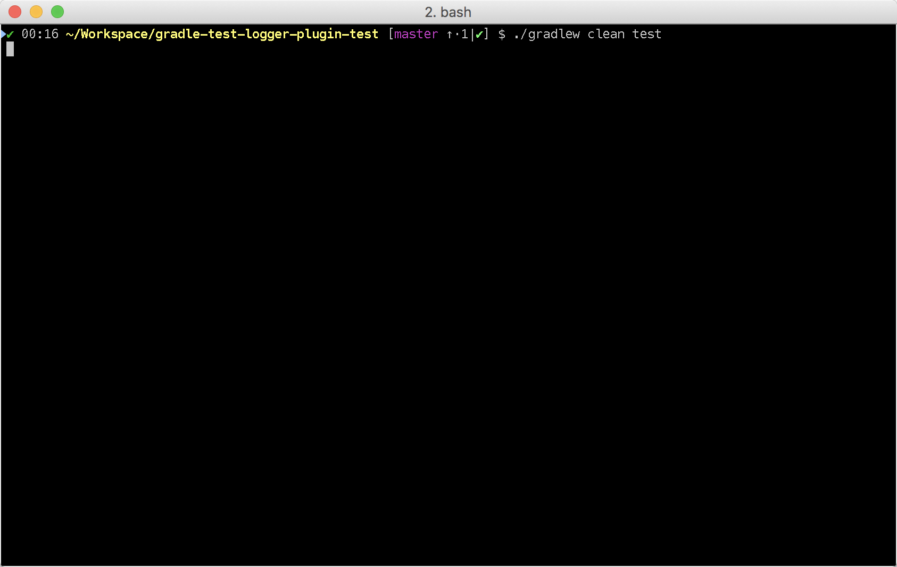

# Gradle Test Logger Plugin
[](https://circleci.com/gh/radarsh/gradle-test-logger-plugin/tree/develop)
[](https://ci.appveyor.com/project/radarsh/gradle-test-logger-plugin/branch/develop)
[](https://coveralls.io/github/radarsh/gradle-test-logger-plugin?branch=develop)
[](https://plugins.gradle.org/plugin/com.adarshr.test-logger)
[](https://github.com/radarsh/gradle-test-logger-plugin/blob/develop/LICENSE)

A Gradle plugin for printing beautiful logs on the console while running tests.

## Standard theme


## Mocha theme



## Usage

### Modern Gradle

```groovy
plugins {
    id 'com.adarshr.test-logger' version '1.1.1'
}
```

### Gradle < 2.1

```groovy
buildscript {
    repositories {
        maven {
            url 'https://plugins.gradle.org/m2/'
        }
    }
    dependencies {
        classpath 'com.adarshr:gradle-test-logger-plugin:1.1.1'
    }
}

apply plugin: 'com.adarshr.test-logger'
```

## Configuration

### Switch themes

```groovy
testlogger {
    theme 'mocha'
}
```

The following themes are currently supported:

1. `plain` - displays no colours or Unicode symbols
2. `standard` - displays colours but no Unicode symbols
3. `mocha` - similar to what [Mocha's](https://github.com/mochajs/mocha) [spec reporter](https://mochajs.org/#spec)
prints, with colours and Unicode symbols

### Hide exceptions

By default, the `showExceptions` flag is turned on. This shows why the tests failed including the location of the
failure. Of course, you can switch off this slightly more verbose logging by setting `showExceptions` to `false`.

```groovy
testlogger {
    showExceptions false
}
```

### Define slow threshold

Tests that are too slow will have their duration logged. However, "slow" is a relative terminology varying widely
depending on the type of tests being executed, environment, kind of project and various other factors. Therefore you
can define what you consider as slow to suit your needs.

```groovy
testlogger {
    slowThreshold 5000
}
```

The default value of `slowThreshold` is `2` seconds. So all tests that take longer than a second to run will have their
actual execution time logged.

If you want to turn off the logging of time taken completely, simply set the threshold to a very large value.

Please note that in themes that support colours, the duration is displayed using a warning style if it is greater than
half the slow threshold. For instance, if `slowThreshold` is 5 seconds any tests that take longer than 2.5 seconds to
run would have their durations logged using a warning style and those that take longer than 5 seconds to run using an
error style.

### Hide summary

By default, a useful summary containing a breakdown of passing, failing and skipped tests along with the total time
taken to execute all the tests is shown. Of course, you can disable this if you prefer a more succinct output.

```groovy
testlogger {
    showSummary false
}
```

## FAQ

### Does it work on Windows?

Mostly. The `standard` and `plain` themes work out of the box but you might have to make a few modifications to your
system settings to see Unicode symbols when using the `mocha` theme.

1. Set or update `JAVA_OPTS` with the system property `-Dfile.encoding=UTF-8`
2. Change the terminal code page to 65001 by executing `chcp 65001`

### How to disable colours and Unicode symbols at runtime such as on Jenkins consoles?

You can switch off ANSI control characters and Unicode symbols by adding `--console=plain` to your Gradle command line.
